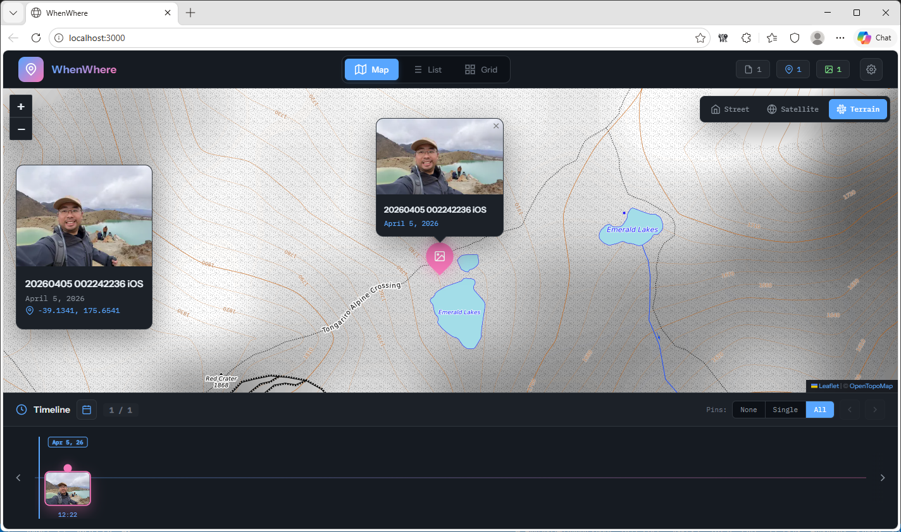

# WhenWhere

Visualize your photos on interactive maps and timelines using GPS metadata from EXIF, XMP sidecars, or Google Photos Takeout exports.



## Install (Windows)

Download the latest installer from **[GitHub Releases](https://github.com/alaning0/whenwhere/releases)** (recommended).

A copy may also be present under [`release/`](release/) in this repo (Git LFS).

1. Double-click the installer and follow the prompts
2. Launch **WhenWhere** from the Start Menu or desktop shortcut
3. On first launch, choose your photos folder (and metadata adapter) in **Settings**

No Node.js install is required for the packaged app. Paths are saved under `%APPDATA%\whenwhere\`.

Installed builds check [GitHub Releases](https://github.com/alaning0/whenwhere/releases) for updates and can install them in-app (**Help → Check for Updates…**).

To build the installer locally or publish a new release, see [CONTRIBUTING.md](CONTRIBUTING.md).

## Features

- **Map View**: Interactive Leaflet map with photo markers, clustering, and multiple tile layers
- **Timeline**: Horizontal scrollable timeline sorted by date with virtualized rendering
- **List View**: Photos grouped by month with metadata details
- **Grid View**: Photo gallery grid grouped by date with lazy loading
- **Lightbox**: Full-screen photo/video viewer with keyboard navigation
- **Calendar**: Jump to any date with photos

### Supported Formats

| Media | Extensions |
|-------|------------|
| Images | JPEG, PNG, GIF, WebP, HEIC |
| Videos | MOV, MP4, M4V |

### Metadata Sources

| Adapter | Source | Use Case |
|---------|--------|----------|
| `exif` | Embedded EXIF data | iCloud Photos exports, camera imports |
| `xmp` | XMP sidecar files | osxphotos exports with `--sidecar xmp` |
| `google-takeout` | JSON metadata files | Google Photos Takeout exports |

## Prerequisites (development)

- Node.js 24+ (Active LTS)
- npm

Development setup, local packaging, and the **tag → GitHub Release** flow are documented in [CONTRIBUTING.md](CONTRIBUTING.md).

## Quick Start (development)

### 1. Clone and Install

```bash
# Install server dependencies
cd server
npm install

# Install frontend dependencies
cd ..
npm install
```

### 2. Run

```bash
# Browser: server + React dev server
npm start

# Or desktop shell (Electron)
npm run electron:dev
```

- Frontend: http://localhost:3000
- API: http://localhost:3002

On first run, open **Settings** in the app and choose your photos folder. You can also set defaults for development via `server/.env` (optional):

```bash
cp server/.env.example server/.env
```

Example `.env`:
```bash
ADAPTER=exif
IMAGES_DIR=/path/to/your/photos
THUMBNAILS_DIR=/path/to/thumbnails
PORT=3002
```

## Configuration

Prefer the in-app **Settings** panel (photos folder, thumbnails folder, metadata adapter). Settings are stored in `config.json` (`%APPDATA%\whenwhere\` in the packaged app, or `server/config.json` in development).

Optional development defaults via `server/.env`:

| Variable | Default | Description |
|----------|---------|-------------|
| `ADAPTER` | `exif` | Metadata adapter: `exif`, `xmp`, or `google-takeout` |
| `IMAGES_DIR` | _(required in UI)_ | Directory containing your photos |
| `THUMBNAILS_DIR` | `<IMAGES_DIR>/.thumbnails` | Where to store generated thumbnails |
| `PORT` | `3002` | Server port |

## Architecture

```
┌─────────────────────────────────────────────────────────────────────┐
│                         FRONTEND (React)                            │
│                        localhost:3000                               │
├─────────────────────────────────────────────────────────────────────┤
│  App.js                                                             │
│  ├── MapView.js      (Leaflet map with clustered markers)          │
│  ├── Timeline.js     (Virtualized horizontal timeline)             │
│  ├── ListView.js     (Grouped list view by month)                  │
│  ├── GridView.js     (Photo grid gallery by date)                  │
│  └── Lightbox.js     (Fullscreen photo/video viewer)               │
└─────────────────────────────────────────────────────────────────────┘
                                │
                                │ REST API
                                ▼
┌─────────────────────────────────────────────────────────────────────┐
│                        BACKEND (Express)                            │
│                        localhost:3002                               │
├─────────────────────────────────────────────────────────────────────┤
│  server/index.js                                                    │
│  ├── config.js           (Environment-based configuration)         │
│  └── adapters/                                                      │
│      ├── exifAdapter.js  (EXIF metadata from images)               │
│      ├── xmpAdapter.js   (XMP sidecar files)                       │
│      └── GooglePhotosTakeoutAdapter.js  (JSON metadata)            │
└─────────────────────────────────────────────────────────────────────┘
                                │
                                │ File System
                                ▼
┌─────────────────────────────────────────────────────────────────────┐
│                       YOUR PHOTOS                                   │
├─────────────────────────────────────────────────────────────────────┤
│  IMAGES_DIR/                                                        │
│  ├── *.jpg, *.heic, *.png   (Images)                               │
│  ├── *.mov, *.mp4           (Videos)                                │
│  ├── *.xmp                  (XMP sidecars, if using xmp adapter)   │
│  └── *.json                 (Takeout metadata, if using google)    │
└─────────────────────────────────────────────────────────────────────┘
```

## API Reference

| Method | Endpoint | Description |
|--------|----------|-------------|
| GET | `/api/photos` | List all photos with metadata |
| GET | `/api/photos?withLocation=true` | Filter to photos with GPS data |
| GET | `/api/photos?withMedia=true` | Filter to photos with media files |
| GET | `/api/photos/:id` | Get single photo details |
| GET | `/images/:filename` | Serve media file |
| GET | `/images/:filename?thumb=true` | Serve thumbnail (WebP, 300px) |
| GET | `/api/thumbnails/status` | Thumbnail generation progress |
| POST | `/api/thumbnails/priority` | Prioritize thumbnail generation |
| GET | `/api/scan/progress` | SSE endpoint for scan progress |
| GET | `/api/adapter` | Get current adapter info |
| POST | `/api/refresh` | Force refresh the cache |
| GET | `/api/health` | Health check |

### Photo Object Schema

```typescript
interface Photo {
  id: string;              // Stable unique identifier (hash of the file path)
  filename: string;        // Media filename
  title: string;           // Display title
  url: string | null;      // Full media URL
  thumbnail: string | null; // Thumbnail URL
  date: string;            // ISO 8601 date
  dateFormatted: string;   // "January 1, 2024"
  dateShort: string;       // "Jan 1, '24"
  timeFormatted: string;   // "3:45 PM"
  timeShort: string;       // "15:45"
  lat: number | null;      // GPS latitude
  lng: number | null;      // GPS longitude
  hasLocation: boolean;    // Has GPS coordinates
  hasMediaFile: boolean;   // Has media file on disk
  isVideo: boolean;        // Is video file
  isImage: boolean;        // Is image file
  size: number;            // File size in bytes
  location: string;        // Formatted coordinates
}
```

## Creating Custom Adapters

To support a new metadata source, create an adapter in `server/adapters/`:

1. Copy `_template.js` as your starting point
2. Implement `scanPhotos(imagesDir, serverPort, onProgress, options)` — forward `options.excludeDirs` to `getAllFilesRecursively` if you scan recursively
3. Implement `getAdapterInfo()`
4. Add your adapter to the map in `server/index.js`

See `server/adapters/_template.js` for full documentation.

## Performance

- **Parallel scanning**: Metadata is read with bounded concurrency using async I/O
- **Virtualized lists**: Timeline, grid, and list views use windowing for smooth scrolling
- **Marker clustering**: Map clusters thousands of markers efficiently
- **Background thumbnails**: Generated asynchronously after initial scan
- **Priority queue**: Visible thumbnails generated first
- **HEIC conversion cache**: Full-size HEIC→JPEG conversions are cached on disk
- **IndexedDB cache**: Photos cached locally for instant reload
- **Lazy loading**: Images load on-demand

## Security

The server binds to `127.0.0.1` only — the photo library and config API are never reachable from the network.

## File Structure

```
whenwhere/
├── release/
│   └── WhenWhere Setup *.exe   # Windows installer (Git LFS)
├── electron/
│   ├── main.js                 # Electron main process
│   └── preload.js              # Folder picker bridge
├── public/
│   └── index.html
├── server/
│   ├── .env.example            # Optional dev defaults
│   ├── config.js               # Configuration loader
│   ├── index.js                # Express server
│   ├── package.json
│   └── adapters/
│       ├── _template.js
│       ├── utils.js
│       ├── exifAdapter.js
│       ├── xmpAdapter.js
│       └── GooglePhotosTakeoutAdapter.js
├── src/
│   ├── config.js
│   ├── App.js
│   ├── components/
│   │   ├── Settings.js         # In-app configuration
│   │   ├── MapView.js
│   │   ├── Timeline.js
│   │   ├── ListView.js
│   │   ├── GridView.js
│   │   ├── Lightbox.js
│   │   └── ...
│   └── services/
│       └── photoCache.js
├── package.json
└── README.md
```

## Exporting Photos

### From Apple Photos (via osxphotos)

```bash
osxphotos export /path/to/export \
  --sidecar xmp \
  --download-missing \
  --verbose
```

Then set `ADAPTER=xmp` and `IMAGES_DIR=/path/to/export`.

### From Google Photos

1. Go to [Google Takeout](https://takeout.google.com)
2. Select only "Google Photos"
3. Download and extract

Then set `ADAPTER=google-takeout` and `IMAGES_DIR=/path/to/Google Photos`.

### From iCloud Photos

Use Apple's built-in export or a third-party tool. EXIF data is preserved in the images.

Then set `ADAPTER=exif` and `IMAGES_DIR=/path/to/photos`.

## Known Limitations

- Video metadata extraction not yet supported — in EXIF mode videos use the file's date and have no GPS pin
- Photos without EXIF dates (screenshots, PNGs) fall back to the file's creation/modification date
- View mode / filter preferences are not persisted yet (folder settings are)

## License

MIT
